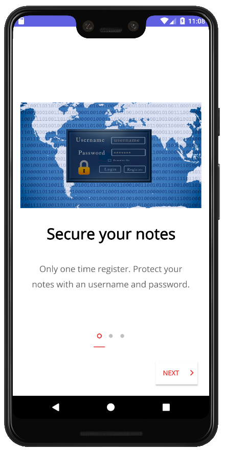
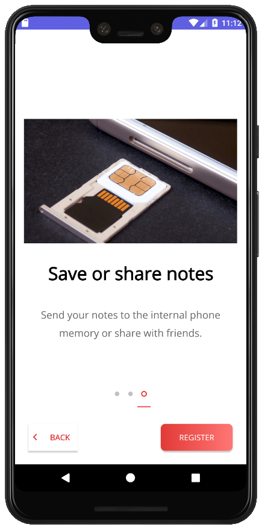

# Handy-Notepad
Architecture components, ViewModel, Glide, Permissions, Room DB, Shared Preferences

Simple notepad app - v1.0

**Status:** *Published*

This project was published in Google Play (1st version): https://play.google.com/store/apps/details?id=com.devproject.fagundezdev.handynotepad

### Visual results and code structure

 -  
 -  
 - 

